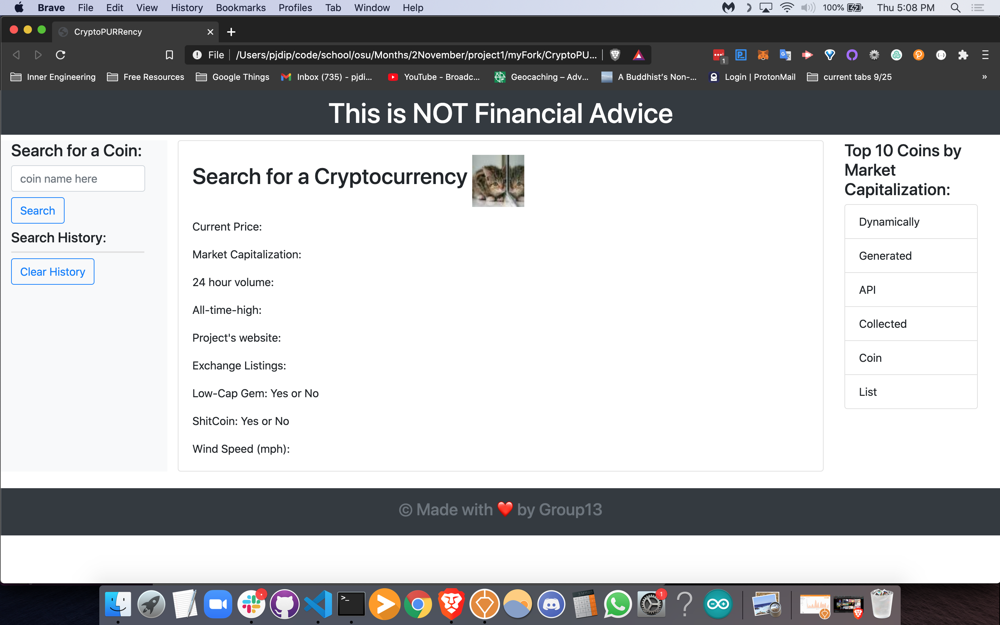

# 06 Server-Side APIs: Weather Dashboard

## Project Title

CryptoPURRency

## Project Description

The world of cryptocurrency blends finance and technology, two things that the general public often struggle to understand. Unfortunately, getting involved in cryptocurrency without addressing this lack of knowledge can lead investors to get rekt. Additionally, many cryptocurrency websites do not make it easy for first-time users to enter the space. Users are often hit with a vast amount of data that can be overwhelming and off-putting. Our project will provide the user with just enough information to pique their curiosity and incentivize them to dig a little deeper on their own. We will hit them with only the choice nugs and basic explanations so that they can develop a baseline understanding before going further down the rabbit hole. We will incorporate some kitties to keep things light-hearted lol

## User Story

```
AS A crypto-curious person
I WANT a simple UX for learning the basics about a coin I search for
SO THAT I can have a starting point to begin my own research into cryptocurrency

```

## Acceptance Criteria

```
GIVEN a cryptocurrency app with form inputs
WHEN I search for a coin
THEN I am presented with current and historical data about that coin (and that coin is added to the search history *maybe we will do this*)
WHEN I don't know the names of any coins to search
THEN I am presented with a list of the top 10 coins by market cap
WHEN I click on one of those coins
THEN I am presented with current and historical data for that coin
WHEN I view current data for that coin
THEN I am presented with a link to that project's website, the market cap, current price, the all-time-high price, 24 hour volume, whether it is potentially a low-cap gem or shitcoin, and the number of exchanges it is listed on (possibly a list of exchanges with ratings)
WHEN I view the historical data for that coin
THEN I am presented with the price 30 days ago, 180 days ago, and 1 year ago (preferably in graph form)

```

The following image demonstrates the application functionality:


## API

coingecko
giphy
possibly others